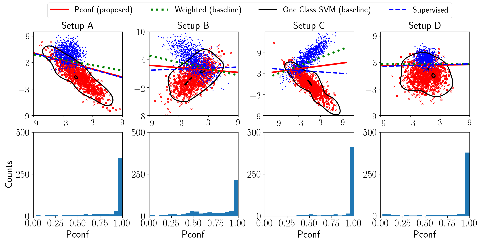

# Positive-Confidence (Pconf) Classification

This repository gives the implementation for Positive-Confidence (Pconf) classification that was proposed in the paper *"Binary Classification from Positive-Confidence Data"* (NeurIPS 2018).

## Implementation
We use two Gaussian distributions for the positive and negative classes.  For Guassian distributions, we can analytically calculate the positive posterior which we use for the confidence values.  We perform Pconf classification and compare it with several baselines: Naive weighted classification, one-class SVM, and fully-supervised classification.  These classifiers are implemented in `components.py`.

This code can be used to reproduce the synthetic experiments with true positive-confidence in Section 4.1 of [our paper](https://arxiv.org/abs/1710.07138).
Note that the synthetic experiments with noisy positive-confidence can be conducted by adding zero-mean Gaussian noise to the true confidence.

### Requirements
- Python 3.6
- numpy 1.13
- Pytorch 0.4
- matplotlib 2.1.1

### Getting started
```bash
$ python visualize.py
```

### Expected results


### References
For the details, please see the paper [here](https://arxiv.org/abs/1710.07138).
```
@article{pconf,
	author = {Takashi Ishida and Gang Niu and Masashi Sugiyama},
	title = {Binary Classification from Positive-Confidence Data},
	booktitle = {NeurIPS},
	year = {2018}
}
```
You can also see some of our other materials below:

- [**YouTube video**: 3 minute video explaining the main idea of Pconf classification](https://youtu.be/2BpJcOf-1XA)
- [**Poster**: used for poster presentation at NeurIPS 2018](./poster.pdf)
- [**Slides**: used for spotlight presentation at NeurIPS 2018](./spotlight_slides.pdf)

If you have any further questions, please feel free to send an e-mail to ishida at ms.k.u-tokyo.ac.jp.
